# Milestone-2 Project / Pair the animals /
## Interactive Frontend Develpment Project

View the live project [here](https://syler11.github.io/MS2-Matching-Game/).

## Table of Content

1. [Project Goals](#project-goals)
    1. Website owner goals
    2. User goals
2. [UX](#user-experience)
    1. User stories
    2. Scope
    3. Design
    4. Colours
    5. Fonts
    6. Imagery
    7. Structure
    8. Wireframes
3. [Features](#features)
4. [Technologies Used](#technologies-used)
5. [Testing](#testing)
    1. HMTL Validation
    2. CSS Validation
    3. Accessiblity Validation
    4. Lighthouse test
    5. JS Hint Validation
    6. User stories testing
6. [Bugs](#Bugs-found-and-resolved-during-development)
7. [Deployment](#deployment)
    1. GitHub Pages
    2. Clone a Respirosatory
    3. Browser preview
    4. VS Code
    5. Email.js
8. [Credits](#credits)
    1. Media Credits
    2. Image Credits
    3. Acknowledgment

## **1. Project Goals**

### Website owner goals
* Create an easy game what can be played for kids
* The goal is too create an intuitive game what can be understand even without able to read the rules
* To engage users to send feedback for future development
* I want to make sure that the website is fully responsive.

### User goals
* Enjoy the game while playing
* To try all levels
* Learn the rules before the game (age permitted)
* Receive interactive feedback from the game

## **2. UX - User Experience**
### User stories
#### First-time users
1. As first-time user, I want to understand the objective of the game.
2. As first-time user, I want to try all different level.
3. As first-time user, I want to see able to follow my progress with steps and score count. 
4. As first-time user, I want to see how long does it take to complete the game. 
5. As first-time user, I want to navigate the website easily. 
6. As first-time user, I want to get feedback that the game is completed.

##### Returning visitor
7. As a regular visitor, I want to mesaure my time to see my progress.
8. As a regular visitor, I want to select different level to challenge myself.
9. As a regular visitor, I want to send feedback of the game. 

#### Site owner
10. As a site owner, I want to receive feedback from the users easily. 
11. As a site owner, I want to make sure that user don't use the backwards button if would navigate to a page which doesn't exist. 
12. As a site owner, I want to make sure that users can follow the page on social media. 
### Scope

The project scope was outlined as followed:
* Easily understood navigation whent he user arrives to the main page.
* How-to section explains the rules of the game.
* Level selector so the user can launch the game.
* How-to section disappers and game board loading after game level selected. 
* Timer starting when the game is selected.
* Steps count as user turning the cards.
* Score count as user matching he cars.
* Reload button to to reset the game.
* Need help? button if the user needs help. 
* Feedback once the game is completed. 
* Contact page to leave feedback to the website owner.
* 404 page with return home button if the user tries to navigate to page which doesn't exist. 

Future improvements:
* Website to memorize user previous score and times and provide with personal best time. 
* Website to challenger users against each other time as per their age. 
* Audio animation when cards a clicked and matched and game completed. 

### Design
The goal of the design was to create a visually appealing game which attractive for younger kids. 

#### Colours:
**Background colour:** #000 with a canvas image covering the body area.  
**Font colour:** default #fff and rgb(129, 58, 8); for Nav elements, Horizontal line and Level Selector

#### Fonts:
My fontfamily choice is "Fuzzy Bubbles" with Sans Serif fall back. Credit to Google Font. 
#### Imagery:
I used a canvas background picture what give an atractive landing page for users to arrive.   
Credit to Rawpixel for imagery.     
All Aninal cards were selected to create a fun and appealing experince for users. 

#### Structure:
The website consist of the 2 separated pages namely index.html and contact.html and a 404.html to guide people back to the main website.   
Having small kids myself (4yrs, 8 yrs)I have taken their opining on board when selecting the design to make sure they would be happy to play the game. 

#### Wireframes:

Main screen

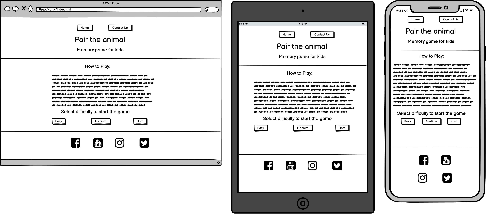

Game screen

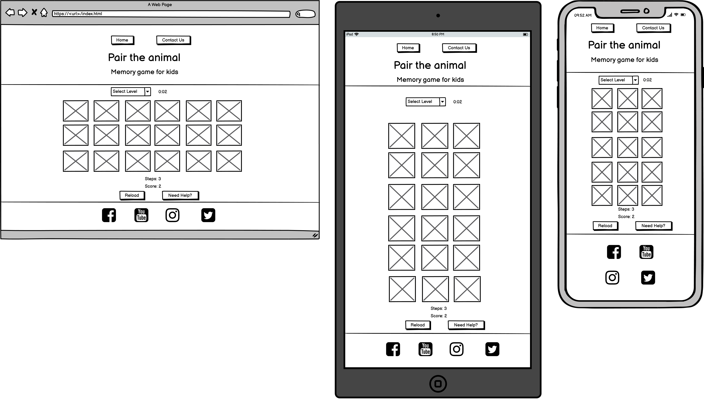

Contact screen

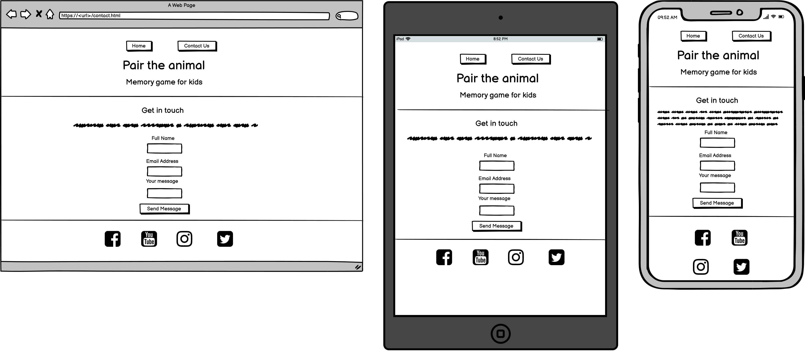

404 screen

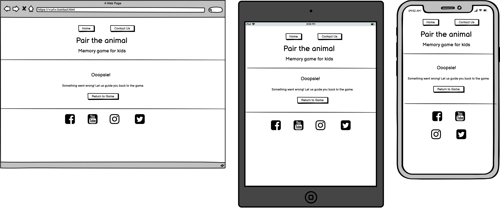

## **3. Features**
The website consist of three separated webpages and 8 features.
### Header

* Features on all pages
* Contains the navigation bar 
* Main title
* Description of the website
* User story covered: 5
 

Header

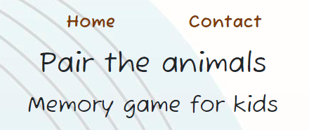

### Footer 
* Features on all pages
* Contains the Social Media icons what would navigate the users to the website media page. 
* User story covered: 12
 

Footer

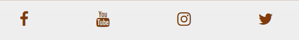

### Main screen rules
* Contains the how to section which outline the rules of the game
* User story covered: 1
 

Main screen rules

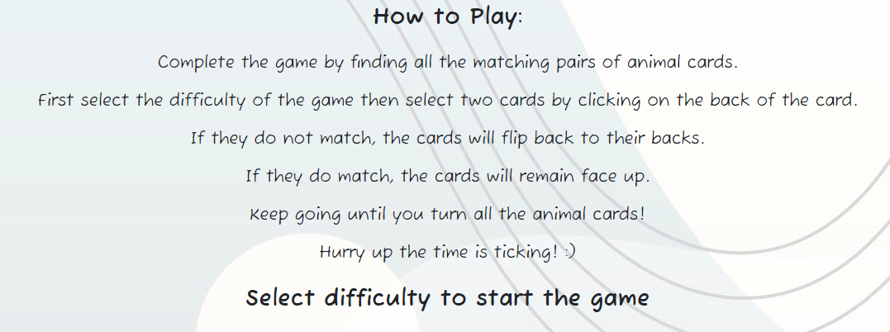

### Main screen levels
* Contains the Level Selector what will launch the games by clicking either on the Easy, Medium or Hard level.
* User story covered: 2, 9
 

Main screen levels

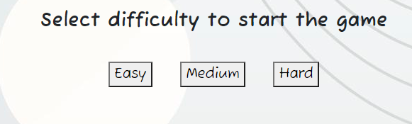

#### Game Board
* Contains the in-game level selector.
* Contains the timer to measure completion time
* Contains the playing cards as per the level the user selected. 6 cards for easy, 12 cards for medium and 18 cards for hard level.
* Contains a reload button what resets the selected game.
* Contains a Need Help button what navigates to the contact.html page. See further below. 
* User story covered: 3, 4, 7
 

Game Board

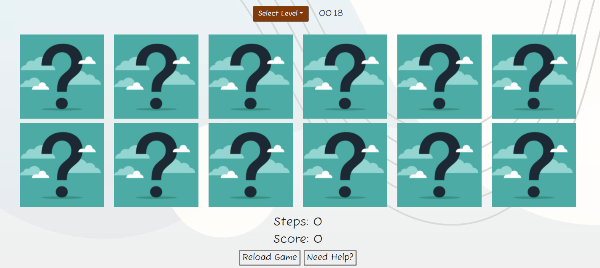

#### Game result feedback
* Contains the game result to the user and also some teasing to try another Levels. 
* User stroy covered: 6
 

User feedback

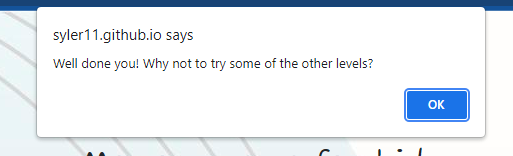

 

### Contact page (contact.html)
* Contains the email form what needs to be completed and submitted to send feedback to the website owner.  
Validation is added to the input fields so empty message cannot be sent without valid Name, Email address and Message fields. 
* Users tory covered: 9, 10
 

Contact page

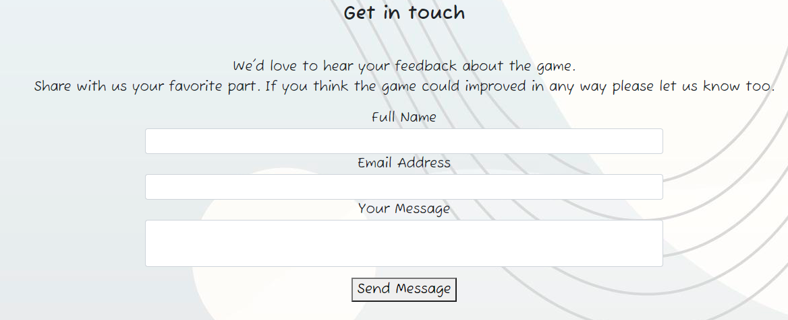

### 404 Page (404.html)
* Contains feedback to the user and something didn't go according to the plan.
* Contains a Return to Game button what makes it easy for the user to navigate back to the main page. 
* User story covered: 11
 

404 Page

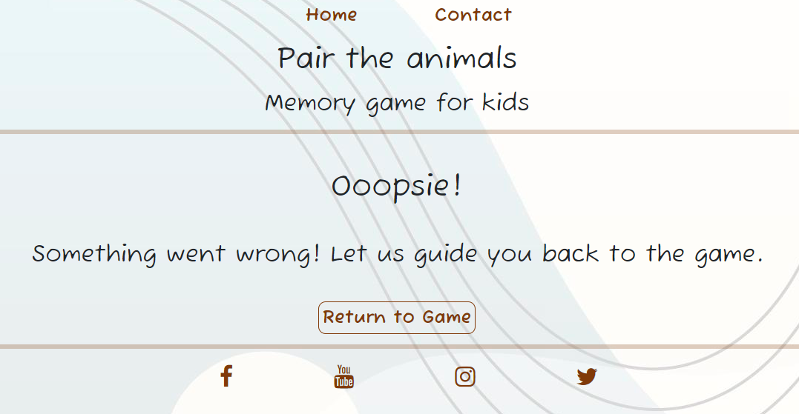

## **4. Technologies used:**
The following languages and framework were used to create this project.  
* HTML5 – provided the main structure of the website.
* CSS3 – provided the styling of the website and the overall content.
* Javascript - Vanilla Javascript was used throughout the whole project
* Email.js provided the framework for the email function 
* Bootstrap 5.0.0 – provided the responsive structure and some other component such as responsive layout, dropdown menu, and form. 
* Balsamiq - development tool was used to create the wireframe for the website. 
* VS Code - VS Code was used for version control to commit and Push to GitHub.
* GitHub - GitHub is used to store the projects code after being pushed from VS Code.

## **5. Testing:**

Games was developed on Windows OS in Goggle Chrome and it was tested in Miscrosoft Edge.  
It was also tested on Apple iPad and iPhone 12.   
All fully functioning and fully responsive.
My kids aged 4 and 8 were appropiate testing subjects and both of them managed to complete the game and navigate on the website. 

### HTML Validation
The W3C Markup Validation Service was used to validate the HTML of the website. All pages pass with no errors no warnings to show.

index.html

contact.html

404.html

### CSS Validation 
The W3C Markup Validation Service was used to validate the CSS of the website. Style.css page pass with no errors no warnings to show.

style.css

### Accessibility 
The WAVE WebAIM web accessibility evaluation tool what measures accessibility standards. All pages pass with 0 errors.

index.html Accessiblity result

contact.html Accessiblity result

404.html Accessiblity result

### Chrome Lighthouse Test

1. Opened up my deployed webpage in a new incognito tab in Google Chrome.  
2. I used CTRL+SHIFT+I key command to prompt the Developer Tool.
3. I navigated to the Lighthouse menu option (usually the option is not visible but clicking on the  >> sign will reveal it)
4. I generated a report for the index.html page 

Chrome Lighthouse report

### JS Hint Validation
JSHint Static Code Analysis Tool for JavaScript was used to validate the Javascript files. No significant issues were found.

main.js validation

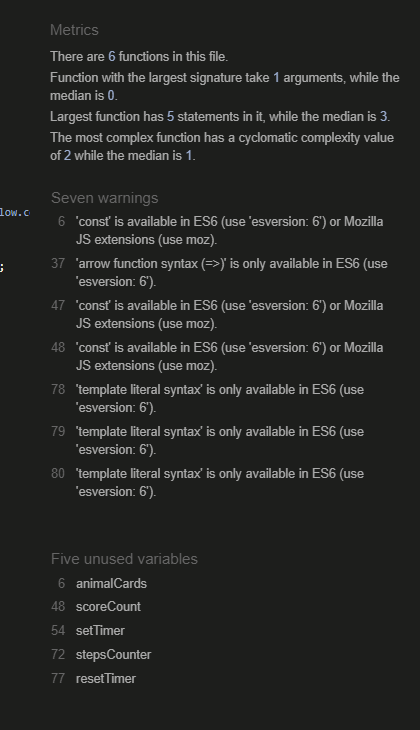

easygame.js validation

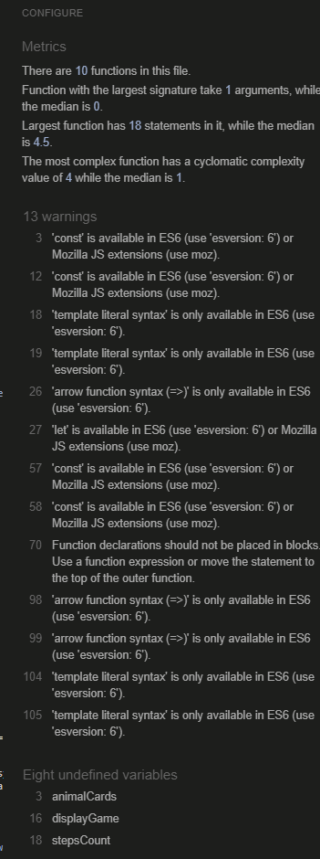

mediumgame.js validation

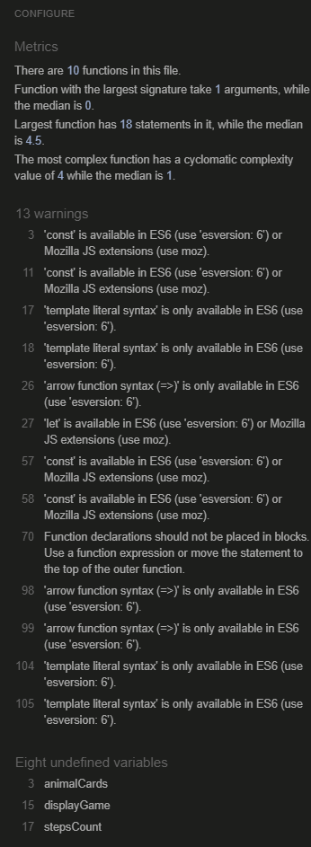

hardgame.js validation

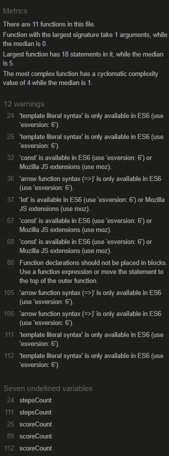

email.js validation

### User stories testing

1. As first-time user, I want to understand the objective of the game.

| **Feature** | **Action** | **Expected Result** | **Actual Result** |
|-------------|------------|---------------------|-------------------|
| Main screen rules | Loading the main page| The main screen loads and display the game objectives | Works as expected |
 

Main screen rules

2. As first-time user, I want to try all different level.

| **Feature** | **Action** | **Expected Result** | **Actual Result** |
|-------------|------------|---------------------|-------------------|
| Main screen levels |Clicking on the choosen level| The game board loads with the selected level | Works as expected |
 

Main screen levels

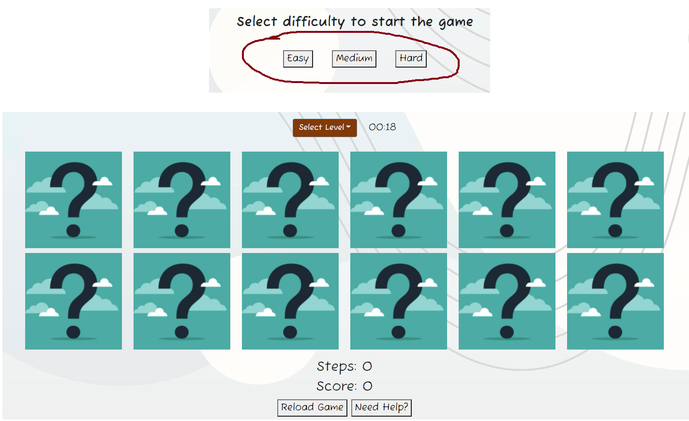

3. As first-time user, I want to see able to follow my progress with steps and score count. 

| **Feature** | **Action** | **Expected Result** | **Actual Result** |
|-------------|------------|---------------------|-------------------|
| Game board |By choosing the level and game board displays and the step and score count activated| With every pair of cards turned the step count will incremetn by one if there is a match the score count will increment by one | Works as expected |
 

Main screen levels

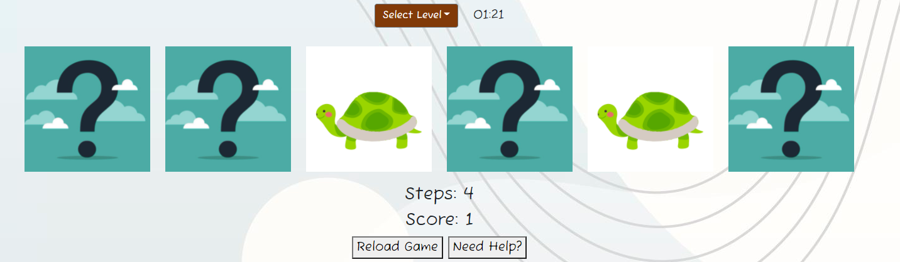

4. As first-time user, I want to see how long does it take to complete the game. 

| **Feature** | **Action** | **Expected Result** | **Actual Result** |
|-------------|------------|---------------------|-------------------|
| Game board |By choosing the level and game board displays the timer which is now counting| The timer is counting the seconds from 0:00 | Works as expected |
 

Game board

5. As first-time user, I want to navigate the website easily.  

| **Feature** | **Action** | **Expected Result** | **Actual Result** |
|-------------|------------|---------------------|-------------------|
| Header |Loading any webpage| The navigation is displayed at the top of the page on any webpage | Works as expected |
 

Header

6. As first-time user, I want to get feedback that the game is completed. 

| **Feature** | **Action** | **Expected Result** | **Actual Result** |
|-------------|------------|---------------------|-------------------|
| Game result feedback |Turning the matches in the game| Display message that the games was finished. | Works as expected |
 

Game result feedback

7. As a regular visitor, I want to mesaure my time to see my progress.

| **Feature** | **Action** | **Expected Result** | **Actual Result** |
|-------------|------------|---------------------|-------------------|
| Game board |Turning all the cards| The timer stops when all cars are turned | Works as expected |
 

Game board

8. As a regular visitor, I want to select different level to challenge myself.

| **Feature** | **Action** | **Expected Result** | **Actual Result** |
|-------------|------------|---------------------|-------------------|
| Game board |Clicking on In-game level selector| Offers all the available level and by clicking initiates the selected game | Works as expected |
 

Game board

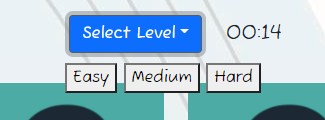

9. As a regular visitor, I want to send feedback of the game. 

| **Feature** | **Action** | **Expected Result** | **Actual Result** |
|-------------|------------|---------------------|-------------------|
| Contact page |Filling up contact form and clicking yes| If all the input fields are filled the message will be sent and user will get notification with message sent | Works as expected |
 

Contact page

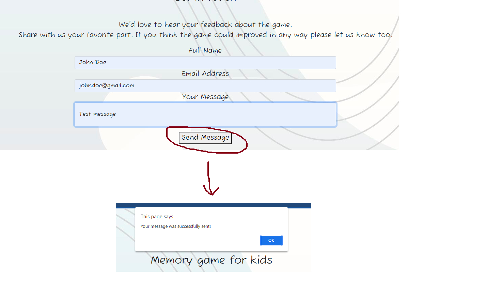

10. As a site owner, I want to receive feedback from the users easily.  

| **Feature** | **Action** | **Expected Result** | **Actual Result** |
|-------------|------------|---------------------|-------------------|
| Contact page |User submitting message| Email will be delivered to the website owner email box | Works as expected |
 

Contact page

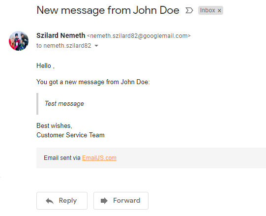

11. As a site owner, I want to make sure that user don't use the backwards button if would navigate to a page which doesn't exist. 
12. As a site owner, I want to make sure that users can follow the page on social media.

## **6. Bugs:**

* Animal cards didn't display all 6 cards in a lime but pushed one card below.  
Solution: once class="row" was applied to the div all 6 cards displayed in a row.

* The social icons and Main Nav werent displaying correctly especially at smaller screen sizes.  
Solution: Media queries were applied to adjust sizing and margin to fit everything in the same row.

* The original question mark card didn't look good with the rest of the page design so I changed halfway through the project.   
Solution: higher contast question mark card was used.

  

* Font color for nav and Level Selector was changed as it didn't pass the Accessibility contrast test.  
Solution: #chocolate was used originally but was changed to rgb(129, 58, 8); for higher contrast.  

* Javascript was used index.html page at the Need Help button to makes sure < ahref wouldn't used as a redundant link.  
Solution: /* Function added to avoid two a href link on the same page - Credit to www.stackoverflow.com */  
document.getElementById("contactPage").addEventListener("click", gotoContactPage);  

function gotoContactPage() {  
    window.location.assign("https://syler11.github.io/MS2-Matching-Game/contact.html");  
}

* Towards the second half of the project the main.js was becoming too big so the file was separated into few smaller files what handles the game functionalities.  
 Solution: easygame.js, mediumgame.js and hardgame.js added to asset folder.

* User was able to open 3 cards in the game.   
 Solution:  Math.min was used to only allow two cards at the time. 

* JS Hint flagged up a redundant semi colon at validation so it was removed in easygame.js / mediumgame.js and hardgame.js.  
Solution: semi colon was deleted

* After duplicating the the hardgame.js to create mediumgame.js and easygame.js there were lot of issues preventing the code run.  
Solutions: All name changes were added correctly so the game would function properly. 

* In game selector wasn't functioning as the exisitng fnction couldn't load the game and giving error in console.
Many function was tested e.g. reload page and reset board game but after page reload the code wasn't executing anymore.     
Soltuion: Clearing the gameboard div only and relaunching the gameboard solved the issue.

## **7. Deployment:**

### GitHub Pages  
The project was deployed to GitHub Pages using the following steps...

1. Log in to GitHub and locate the GitHub Repository  
2. At the top of the Repository (not top of page), locate the "Settings" Button on the menu.  
3. Alternatively Click Here for a GIF demonstrating the process starting from Step 2.
4. Scroll down the Settings page until you locate the "GitHub Pages" Section.
5. Under "Source", click the dropdown called "None" and select "Master Branch".
The page will automatically refresh.
6. Scroll back down through the page to locate the now published site link in the "GitHub Pages" section.

### Clone a Repository* 
1. On GitHub, navigate to the main page of the repository.
2. Above the list of files, click  Code.
3. To clone the repository using HTTPS, under "Clone with HTTPS", click . To clone the repository using an SSH key,   
including a certificate issued by your organization's SSH certificate authority, click Use SSH, then click.   
To clone a repository using GitHub CLI, click Use GitHub CLI, then click.
4. Open Git Bash.
5. Change the current working directory to the location where you want the cloned directory.  
6. Type git clone, and then paste the URL you copied earlier.  
7. Press Enter to create your local clone.

### Browser Preview
Browser preview was used between commits using the following steps...

1. Open terminal in GitPod. 
2. With Ctrl+C the cursor was prompt.
3. python3 -m http.server command line was used to open up a private port.
4. Once the port 8000 was serving the page was opened by clicking on the Open Browser tab.

### VS Code
My personal preference is Code. What was used during this project opposed to MS1 when Gitpod was used.
Once I have connected to my Github account all commit were pushed using VS Code.

### Email JS
1. Create an account at emailjs.com 
2. In the integration screen in the emailjs dashboard, note your userid
3. Create a 
 email service in the Email Services section and note the id
4. Create a email template in the Email templates section and note the id
5. Update the script sendEmail.js, method sendMail with your user id, email service id and email template id

## **8. Credits:**
### Media Credits
Credit to https://codeinstitute.net/ for the lesson on email.js  
Credit to https://favicon.io/favicon-converter/ for the Favicon    
Credit to https://websitemockupgenerator.com/ for the Website mockup picture    
Credit to https://fontawesome.com/ for the Icona displayed on the website    
Credit to https://validator.w3.org/ for the html and css validation  
Credit to https://wave.webaim.org/ for accessibility check for the website  
Credit to https://www.emailjs.com/ for email sending functionality for the website   
Credit to https://www.google.com/ for the Lighthouse report  
Credit to https://stackoverflow.com/ for being a valuabe source for various functions e.g. in-game selector buttons /Clearing div content/  
Credit to https://www.youtube.com/watch?v=tjyDOHzKN0w for Ania Kubow for the base of the card game  
Credit to https://www.youtube.com/watch?v=dtKciwk_si4 for Florin Pop for various functions (Step & Score count among many other things)
### Image credits
https://www.rawpixel.com/ - background.jpg  
https://www.rawpixel.com/ - question-mark.png  
https://www.rawpixel.com/nunny - dog.png  
https://www.rawpixel.com/nunny - cat.png  
https://www.rawpixel.com/ - turtle.png  
https://www.rawpixel.com/ - lion.png  
https://www.rawpixel.com/ - elephant.png  
https://www.rawpixel.com/ - kangaroo.png  
https://www.rawpixel.com/ - monkey.png  
https://www.rawpixel.com/ - giraffe.png  
https://www.rawpixel.com/ - frog.png  
https://www.rawpixel.com/ - monkey.png  

### Acknowledgment
I would like to thank my kids who provided me feedback during the projects to make sure they would have fun while they play. They had. :)  
I would like to thank my wife to put up with me when I basically disappeared for a week to finish the project on time after the tight time frame between my course reactivation and MS2 assessment deadline.   
I would like to thank my mentor Mo Shami for the guidance and support. 

